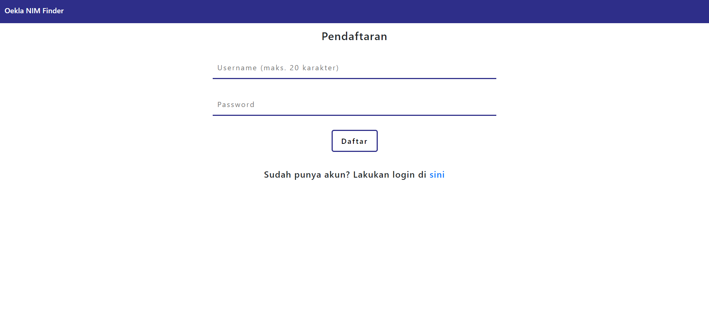
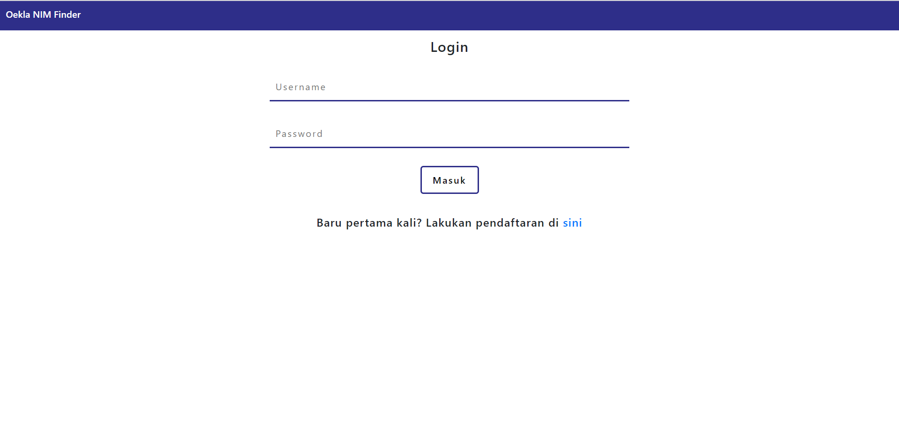
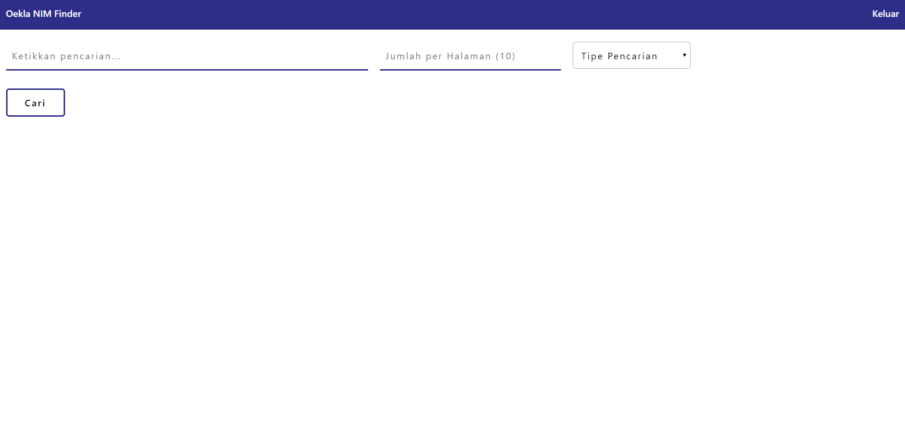
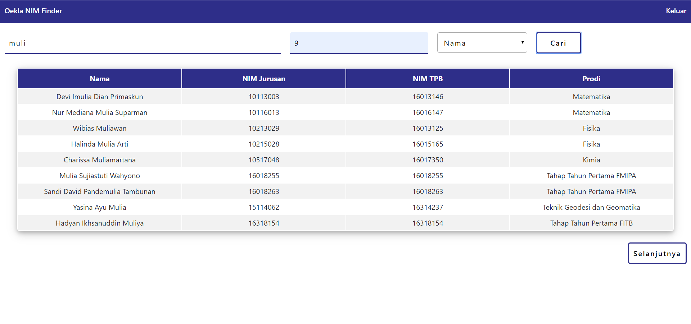

# Oekla NIM Finder
Steve Andreas I - 13517039

Aplikasi ini merupakan NIM <i>Finder</i> ITB yang dibuat menggunakan React. Aplikasi ini dapat mencari mahasiswa ITB berdasarkan nama atau NIM-nya. Data mahasiswa didapat dari API https://api.stya.net/nim. 


## Instalasi
Untuk mejalankan aplikasi ini pada <i>localHost</i>, pertama lakukan <i>clone repository</i> ini di tempat yang diinginkan. Pastikan di perangkat anda sudah terinstall <code>npm</code> https://nodejs.org/en/download/. Selanjutnya buka terminal/cmd dan pindah ke direktori hasil <i>clone</i> tadi dan ketik:

```
npm install
```
<code>npm</code> akan menginstall semua <i>dependency</i> yang dibutuhkan untuk menjalankan aplikasi tersebut. Setelah semuanya terinstall pada terminal/cmd ketik:
```
npm start
```
Pada <i>browser</i> yang anda gunakan akan terbuka <i>tab</i> baru berisi aplikasi ini.

Selain dijalankan pada <i>localHost</i>, aplikasi ini juga dapat diakses melalui https://steveimmanuel.github.io/OeklaNIMFinder/.
## Penggunaan
Setelah berhasil terinstall dengan benar, maka pada <i>browser</i> anda seharusnya akan muncul tampilan pada bagian kiri seperti berikut.
<div style='text-align:center'>

</div>
Pastikan anda sudah terhubung dengan internet, kemudian lakukan pendaftaran pada <i>form</i> tersebut. Jika anda sudah punya akun, anda dapat melakukan <i>login</i> dengan meng-<i>click</i> tulisan sini yang bercetak biru pada gambar kiri di atas dan akan muncul <i>form login</i> seperti pada gambar kanan di atas. 
<div style='text-align:center'>

</div>
Setelah berhasil melakukan <i>login</i>, anda dapat mencari mahasiswa ITB berdasarkan nama atau NIM seperti pada gambar di atas.

## Desain Aplikasi
Pada aplikasi ini terdapat 2 komponen utama yaitu bagian pendaftaran dan <i>login</i> ([Sign.js](src/Sign.js)) dan bagian utama pencariannya ([App.js](src/App.js)). Masing-masing bagian tersebut disusun atas beberapa [komponen](src/components) yang terpisah.

Cara kerja aplikasi cukup sederhana. Pertama saat melakukan daftar, aplikasi akan mengirimkan data ke API. Jika <i>response status</i>-nya OK, maka akan muncul halaman <i>login</i>. Dengan cara yang sama, data <i>login</i> dikirim ke API. Jika <i>response status</i>-nya OK, maka token hasil <i>login</i> akan disimpan pada <i>localStorage</i>. Token inilah yang kemudian akan digunakan untuk request data saat pencarian mahasiswa. 

Setiap kali dilakukan pencarian, sebenarnya aplikasi akan melakukan request terhadap API sebanyak 2 kali, yaitu untuk <i>page</i> ke-0 dan <i>page</i> ke-1. Hal ini digunakan untuk menambahkan fitur <i>next</i> dan <i>previous result</i> supaya mengetahui ada tidaknya data pada <i>page</i> sesudah/sebelumnya. Oleh karena itu komponen [App.js](src/App.js) memiliki setidaknya 3 <i>state</i> yaitu prevResult, curResult, dan nextResult. Jika dilakukan <i>next result</i>, maka hasil request sebelumnya pada nextResult akan ditimpa ke curResult, dan request selanjutnya hanya dilakukan 1 kali untuk mengisi nextResult selanjutnya. Hal yang sama dilakukan pada <i>previous result</i>.

## Kakas
Pada aplikasi ini digunakan kakas berupa:
<ul>
<li>react v16.8.6
<li>react-dom v16.8.6
<li>react-router-dom v5.0.1
<li>react-scripts v3.0.1
<li>bootstrap v4.3.1
</ul>
Kakas-kakas react diinstall dengan <code>create-react-app</code>, sedangkan bootstrap diinstall menggunakan <code>npm install</code>.

## Review
### Aplikasi
Aplikasi yang dibuat sudah cukup baik dan memenuhi spesifikasi yang diberikan. Mungkin kekurangannya adalah pada fitur otentikasi <i>login</i> dikarenakan token hanya disimpan pada <i>localStorage</i> sehingga bisa dengan mudah diganti. Hal ini bisa diperbaiki lagi dengan menggunakan kakas-kakas yang ada.
### API
API yang ada sudah baik, namun mungkin akan lebih baik jika pada saat request pencarian dapat diberikan data mengenai total hasil pencarian yang ada pada database sehingga paginasi pada aplikasi dapat diimplementasikan lebih mudah.